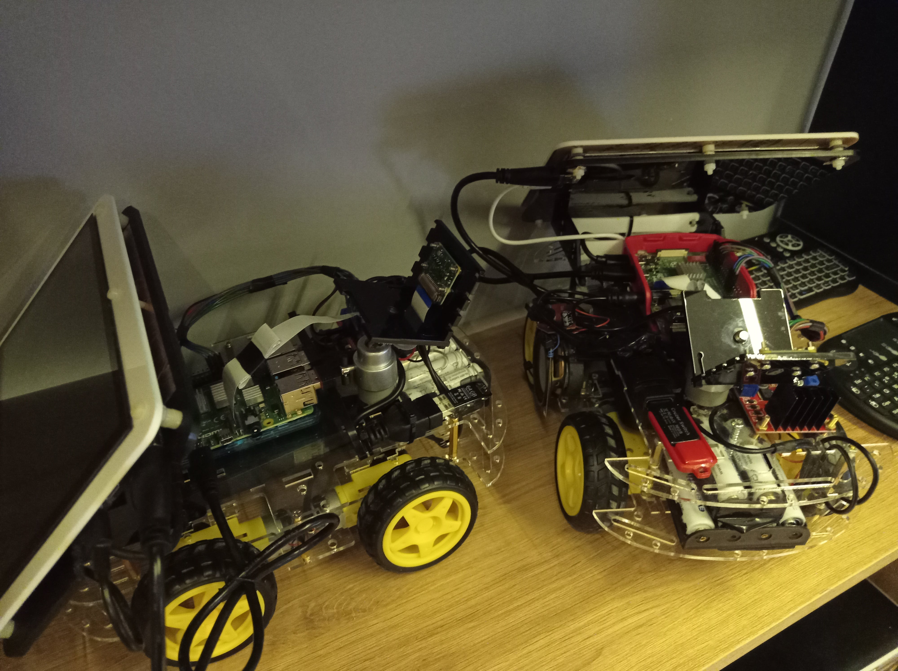

# self-driving-car-raspberry

## General description
This project is a self driving car based on raspberry pi and tensorflow CNN network designed to drive around user created tracks bounds.

## Parts used
1. Raspberry Pi model 4B
2. 7" LCD Screen
3. PiCamera V2
4. Generic USB speaker
5. L298N Two channel motor driver
6. 4 Motors powered by 9V batteries
7. Redmi 18W Fast powerbank 2A 5V
8. bodykit + wheels

## Setup
to train your own model run following steps:
1. collect samples: 
`python drive-rc-collect-samples.py`
use commands:
- w -> go forward
- a -> turn left
- d -> turn right
- s -> go backward
- z -> save sample sequence
2. train model, open jupyter notebook: 
`model_training/ai-acr-train-model.ipynb`
3. replace model in script and run:
`python autodrive.py`

## Instal packages on raspberry
`pip install -r requirements.txt`
download .whl with tensorflow build matching CPU architecture, then
`pip install tensorflow-2.5.0-cp37-none-linux_armv7l.whl`

